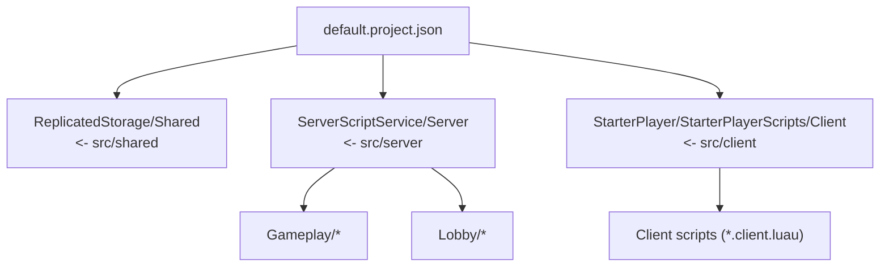
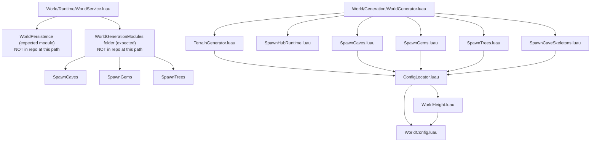
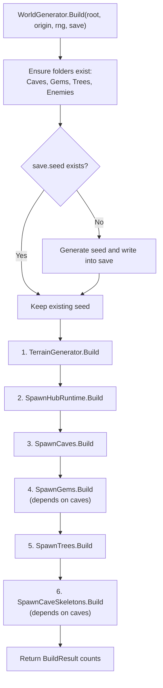
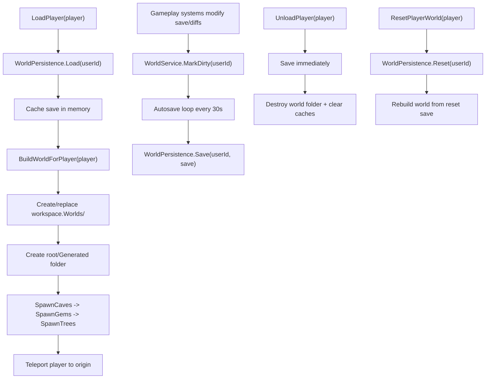

# Woodland

Roblox game project built with Rojo. This README explains how the project is structured, how the main files are connected, and how the world generation/runtime modules are intended to work.

## Overview

The repo is split into three main Rojo-mapped code areas:

- `src/client` -> `StarterPlayer/StarterPlayerScripts/Client`
- `src/server` -> `ServerScriptService/Server`
- `src/shared` -> `ReplicatedStorage/Shared`

The most developed subsystem in this repo is the procedural world generation pipeline under:

- `src/server/Gameplay/World/Generation`
- `src/server/Gameplay/World/Config`
- `src/server/Gameplay/World/Runtime`

## Rojo Mapping (How code gets into Studio)



## Project Structure (High-Level)

### Server

- `src/server/Gameplay`
  - Gameplay systems (inventory, spells, sprint, pickups, time, NPCs)
  - World generation/runtime modules
  - Persistence placeholders and helpers
- `src/server/Lobby`
  - Lobby scripts/services (currently minimal / placeholder)

### Shared

- `src/shared/Remotes/*`
  - Remote event/function containers used by client/server features
- `src/shared/GameConfig.luau`
  - Shared config values

### Client

- `src/client/*.client.luau`
  - Feature scripts for combat, dialogue, hotbar, sprint, audio, UI, etc.

## World System (Current Architecture)

The world subsystem is split into:

- `Config`: tunables and terrain height function
- `Generation`: procedural spawn/build steps
- `Runtime`: world IDs, world instance object, world service API
- `Persistence`: intended save/load modules (currently partly placeholder)

### World Module Dependency Graph



## World Generation Pipeline (Implemented in `WorldGenerator`)

`src/server/Gameplay/World/Generation/WorldGenerator.luau` is an orchestrator that runs world generation modules in deterministic order using a shared `rng` and `save`.

### Generation Order Flowchart



### What each generation file does

- `TerrainGenerator.luau`
  - Fills Roblox terrain water/ocean + land + beach
  - Uses `WorldHeight.heightAt(...)`
  - Flattens spawn-hub area around configured center/radius
- `SpawnHubRuntime.luau`
  - Clones static hub objects from `ServerStorage/Templates/SpawnHubTemplate`
  - Offsets them by world `origin`
- `SpawnCaves.luau`
  - Places cave models on terrain using config spacing/jitter/chance
  - Avoids spawn hub area and world edge margin
- `SpawnGems.luau`
  - Spawns crystals around caves in rings
  - Uses overlap checks to prevent collisions with existing objects
- `SpawnTrees.luau`
  - Dense forest generation with weighted templates and clustering
  - Avoids spawn area, steep slopes, and rocky heights
- `SpawnCaveSkeletons.luau`
  - Spawns enemies around caves
  - Uses terrain height and unanchors humanoid rigs

## Runtime World Objects (Planned / Partially Wired)

### `WorldIds.luau`

Utility module for world identifiers:

- `solo_<userId>` for player-owned worlds
- `world_<GUID>` for general/shared worlds
- parsing + validation helpers

### `WorldInstance.luau`

Defines a runtime object shape for a world:

- `WorldId`, `OwnerUserId`
- `Root`, `Generated`, `Origin`
- `Save`, `Seed`
- `Dirty`, `CreatedAt`

This is a good abstraction for a future `WorldService`, but the current `WorldService` file does not use it yet.

### `WorldService.luau` (Current state)

`src/server/Gameplay/World/Runtime/WorldService.luau` currently implements a per-player world service that:

- creates `workspace.Worlds`
- creates `ReplicatedStorage.Shared.ResetWorld` remote if missing
- tracks in-memory `saves`, `dirty`, and `roots`
- builds a world per player using `SpawnCaves`, `SpawnGems`, `SpawnTrees`
- teleports player to their world origin
- autosaves dirty worlds every 30s

However, it references modules/folders that do not exist at the paths used in the file:

- `script.Parent.WorldPersistence`
- `script.Parent.Parent.WorldGenerationModules`

So this runtime service looks like a legacy or in-progress version that has not yet been updated to the newer `World/Generation/*` layout.

## Player World Lifecycle (as implemented in current `WorldService`)



## Configuration Flow (`WorldConfig` + `WorldHeight`)

`src/server/Gameplay/World/Config/WorldConfig.luau` stores generation constants (sizes, radii, heights, spawn clear zones, cave/tree tuning, etc).

`src/server/Gameplay/World/Config/WorldHeight.luau` computes terrain height using:

- noise layers (`math.noise`)
- deterministic mountain centers (based on a seed stored in `workspace` attribute `WorldSeed`)
- mountain boost added on top of base noise terrain

Important note:

- `WorldHeight` currently uses a workspace-level seed (`workspace.WorldSeed`)
- `WorldGenerator` and runtime save data also contain `save.seed`
- those are not fully unified yet, so per-world deterministic terrain may need refactoring if multiple worlds are generated in one server

## Assets / Templates Required in Studio

Several generation modules expect templates to exist in `ServerStorage`:

- `ServerStorage/Templates/SpawnHubTemplate` (Folder)
- `ServerStorage/Templates/Caves/Cave` (Model)
- `ServerStorage/Templates/Gems/Crystal` (Model)
- `ServerStorage/Templates/Trees/Tree1..Tree4` (Models)
- `ServerStorage/Templates/Characters/Skeleton` (Model)

If these are missing, world generation modules will error.

## Current Gaps / In-Progress Areas

These files are present but are placeholders or not yet connected:

- `src/server/Gameplay/Persistence/WorldStore.luau`
- `src/server/Gameplay/Persistence/Schema.luau`
- `src/server/Gameplay/World/Content/Tags.luau`
- `src/server/Gameplay/World/Content/AssetIds.luau`
- `src/server/Lobby/LobbyBootstrap.server.luau`

Also, `src/server/Gameplay/GameplayBootstrap.server.luau` currently contains a blacksmith animation proximity script rather than a true gameplay bootstrap orchestrator.

## Recommended Wiring Direction (next step)

To align the repo with the newer module structure:

1. Update `WorldService` to require `WorldGenerator`, `WorldInstance`, `WorldIds`, and persistence modules from current paths.
2. Implement `WorldStore` + `Schema` (versioned save format).
3. Add an actual gameplay bootstrap script that:
   - requires `WorldService`
   - connects `Players.PlayerAdded/PlayerRemoving`
   - routes reset remote events
4. Unify terrain seed usage (`WorldHeight`) with per-world `save.seed`.

## Getting Started (Rojo)

Build the place file:

```bash
rojo build -o "Woodland.rbxlx"
```

Or serve directly to Studio:

```bash
rojo serve
```

See [Rojo documentation](https://rojo.space/docs) for workflow details.

